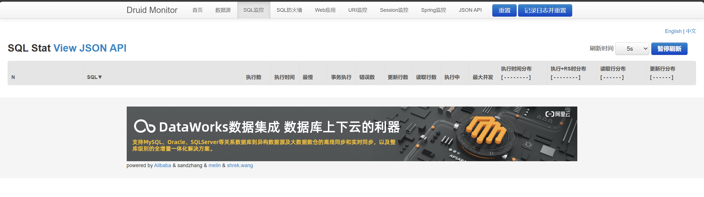
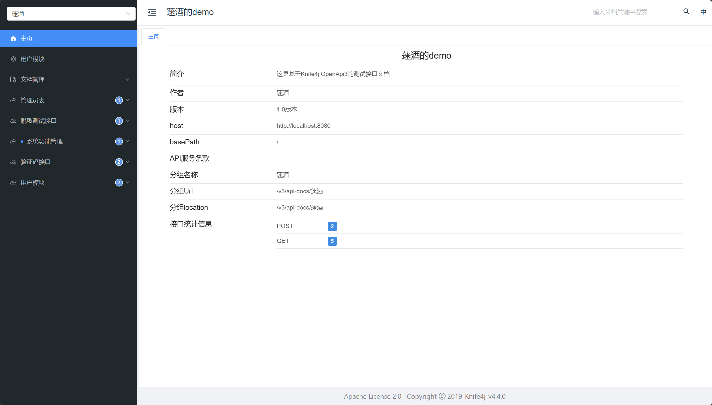
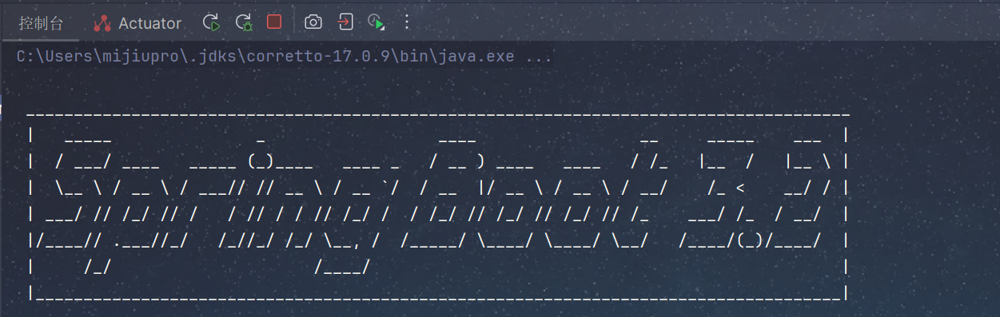
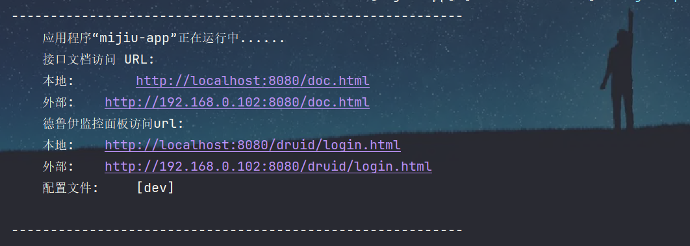
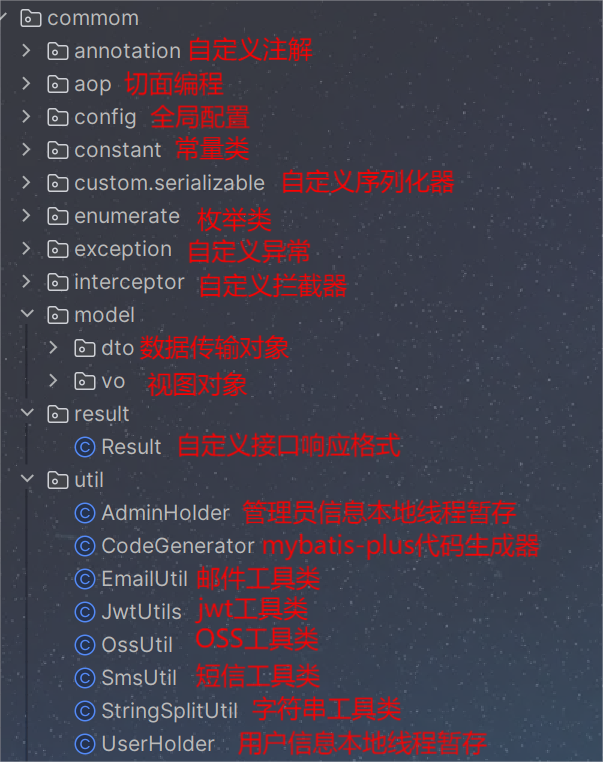

# springboot3x-template

## 整体介绍
本项目为单体架构spring boot3x版本的web后端服务开发模板，整合了众多常用依赖，以及起步功能，适合中作为小项目的工程初始化脚手架。
## 版本介绍
- **java17**
- **maven3.6.1**
- **springboot3.2.2**  
- **其他依赖均采用较新的版本目前并未发现存在依赖冲突、版本不兼容问题**


## 主流框架及组件
#### - mybatis-plus（既保留mybatis完整功能又提供附加增强功能、sql执行拦截器、单表通用业务mapper、代码生成器、分页插件等）
>- generator（代码生成器组件）提供示例代码以及注释，简单配置即可快速生成entity、mapper、service（serviceImpl)、controller层代码结构框架到对应目录下。
>- 整合教程：https://mijiu.blog.csdn.net/article/details/135734561

#### - alibaba druid（数据库连接池）
>- 后台面板sql执行监控辅助定位慢sql

>- 整合教程：https://mijiu.blog.csdn.net/article/details/135738692

#### - spring mvc（开发Java Web应用程序的MVC框架，提供灵活的控制器和视图管理机制）
>- 基础拦截器链设计 相关文档：https://mijiu.blog.csdn.net/article/details/136143401
>- 跨域问题解决 相关文档：https://mijiu.blog.csdn.net/article/details/136334332 
>- 解决swagger接口文档访问被拦截器拦截问题 相关文档 https://mijiu.blog.csdn.net/article/details/140411208

#### - spring validation(注解化参数校验)
>- 提供接口参数校验示例
>- 使用教程：https://mijiu.blog.csdn.net/article/details/136180252

#### - spring aop（面向切面编程、抽取横切逻辑）
>- 提供aop实现统计接口的调用次数代码示例 相关文档：https://mijiu.blog.csdn.net/article/details/135855344
>- 提供aop实现防重复提交代码示例 相关文档：https://mijiu.blog.csdn.net/article/details/137483835
#### - spring 事务(声明式事务、编程式事务)
>- 提供声明式事务业务示例代码
>- 提供编程式事务业务示例代码
>- 使用教程：https://mijiu.blog.csdn.net/article/details/135659962


## 数据存储
#### - mysql关系型数据库
>- 业务数据持久化到硬盘
#### - redis非关系型内存数据库
>- 缓存热点数据高性能读写
>- 中间件辅助实现业务功能(时间窗口接口限流、防重复提交)
>- 整合教程：https://mijiu.blog.csdn.net/article/details/136067550
#### - 阿里云OSS对象存储
>- 静态资源托管
>- 高性能、高并发、高可用、分散服务器带宽压力、高安全

## 常用工具库
#### - lombok
>- 注解生成getter、setter、日志框架、工具类注解、链式构造对象等
#### - hutool工具包
>- 简单http请求、图像验证码生成、加解密、类拷贝、字符串工具等
#### - fastjson解析
>- 三方接口返回响应反序列化
#### - jwt工具包
>- token生成、解析、刷新

## 业务特性
#### - 多环境配置灵活切换
#### - 全局跨域处理
#### - 通用响应类封装
#### - 响应拦截器自动完成响应类封装
#### - 请求拦截器登录状态校验、token自动刷新
#### - 自定义错误码枚举类
#### - 自定义通用业务异常、特殊业务异常
#### - 全局异常处理
#### - 自定义json序列化器实现接口数据脱敏
#### - sql性能监控、慢sql定位  

## 单元测试
#### - spring-boot-starter-test（JUnit 5）
>- 提供单元测试用例示例代码


## 接口文档管理
#### - knife4j(基于Swagger实现的Java文档库，提供了强大的接口文档生成和管理，支持在线调试和接口测试)
>- 提供简单的控制器类添加文档注解示例

>- 整合教程：https://mijiu.blog.csdn.net/article/details/135761392

## 起步业务功能
#### - 用户账密、短信登录/注册
>- 用户表初始化sql
>- 图形验证码接口、短信验证码接口(发送间隔、多发封禁)
>- 短信验证登录自动注册
#### - 系统功能列表获取接口
>- 系统功能表初始化sql
>- 系统功能列表接口([一级功能>二级功能>三级功能,.......]层级树状结构返回)

## 其他
#### - 自定义springboot启动控制台logo

#### - swagger接口文档地址、德鲁伊监控面板访问地址项目启动成功后控制台打印点击直接跳转  


## 目录结构介绍
#### - 大致结构介绍

#### - 公共模块介绍


## 使用说明
1. 克隆项目到本地  

```
git clone https://gitee.com/mi9688-wine/springboot-template
```
2. **maven配置并编译项目(项目根目录已提供maven阿里云镜像仓库的XML配置文件)**
3. **创建数据库并运行初始化sql**
4. **修改配置文件**
>- **修改数据源(mysql、redis)**
>- **修改短信服务、邮件服务、OSS服务配置(按需用到再修改)**
5. 启动项目

## 相关文档
CSDN-springboot专栏：https://blog.csdn.net/qq_62262918/category_12571219.html
欢迎订阅

## 最后
- 任何bug
- 新功能建议  
**欢迎关注私信留言**


